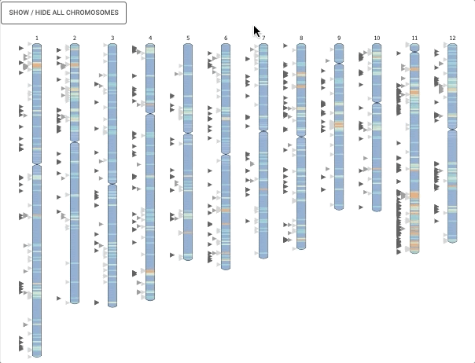
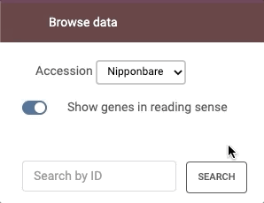

Introduction
============

GeLoc is a WebApp allowing to visualize genes at multiple scales, with current focus on the LRR gene families in rice. However, GeLoc is currently developing in a generic way to be also applied to other families and organisms.

Plant resistance genes are mainly encoded by three large Leucine-Rich Repeat (LRR)-containing receptor (LRR-CR) families: the LRR-Receptor-Like Kinase (LRR-RLK), LRR-Receptor-Like Protein (LRR-RLP) and Nucleotide-binding LRR Receptor (NLR).
We have proposed manually curated annotations of these genes for reference rice genomes: nipponbare (IRGSP-01) and kitaake (KitaakeX-v3.1) japonica cultivars.
These annotations include genes tagged as non-canonical because they contain nonsense mutations, as opposed to canonical genes that contain all expected features to be functional (see Gottin et al. 2021 for further details).

Geloc provides convenient tools to visualised and download these annotation data.

Overview
~~~~~~~~~~~~~

-  Dynamic chromosome painting visualisation

-  Online Data curation of mosaic prediction

-  Markers or Genes Plots on mosaic karyotypes

-  Data and high quality image export

Input formats
~~~~~~~~~~~~~

GeMo requires two types of datasets to generate the ideogram visualization

.. image:: _images/move_range.gif
   :target: _images/move_range.gif
   :width: 250
   :alt: select

Live demo
~~~~~~~~~

GeLoc is available at `<https://rice-tools-genome-hub.southgreen.fr/geloc/>`__ .

Citation
~~~~~~~~

Gottin, C., Dievart, A., Summo, M., Droc, G., Périn, C., Ranwez, V. and Chantret, N. (2021), A New Comprehensive Annotation of Leucine-Rich Repeat-Containing Receptors in Rice. The Plant Journal. Accepted Author Manuscript. https://doi.org/10.1111/tpj.15456
